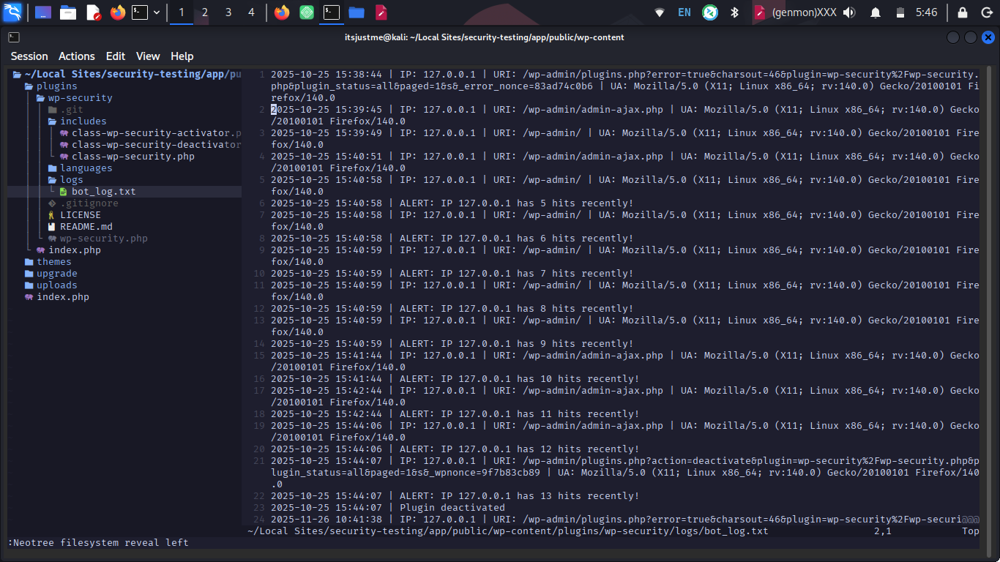

# WP Security Log Monitor

A lightweight WordPress security plugin that logs admin access attempts, failed logins, and suspicious repeated hits. Designed to help detect brute force attacks, bot activity, and unauthorized access patterns.

## 🔒 Overview

This plugin provides:

Logging of all access attempts to:

- /wp-admin

- /wp-login.php

- Logging of all failed login attempts

- Automatic creation of a dedicated log file

- Simple detection of repeated hits from the same IP

- Alerts inside the log file when a threshold is crossed

- Easy-to-read timestamped entries

- This plugin is ideal for small WordPress sites that want basic intrusion visibility without installing heavy-duty security plugins.

## 🛠️ Features

✔️ Tracks admin page access
✔️ Tracks failed login attempts
✔️ Logs IP, URI, timestamp, and user-agent
✔️ Detects repeated hits within 10 minutes
✔️ Creates logs automatically
✔️ Lightweight (no UI, no database overhead)

## Output



- 📦 Installation

1. Create a folder in /wp-content/plugins/

```bash
wp-security-log-monitor
```

2. Activate the plugin in WordPress Dashboard -> Plugins

3. A logs/ directory and bot_log.txt file will be created automatically.


### 🧩 How It Works

The plugin hooks into:

init

Detects any access to /wp-admin or /wp-login.php.

wp_login_failed

Captures and logs failed login attempts.

Log Writing

Entries are appended to /logs/bot_log.txt.

Hit Counting

Counts hits from the same IP in the last 10 minutes.
Trigger threshold is set to 5 hits.

### 🚀 Future Improvements

- Admin dashboard UI for viewing logs

- Automated email alerts for suspicious behavior

- Brute force IP blocking

- Log rotation

- Database integration
